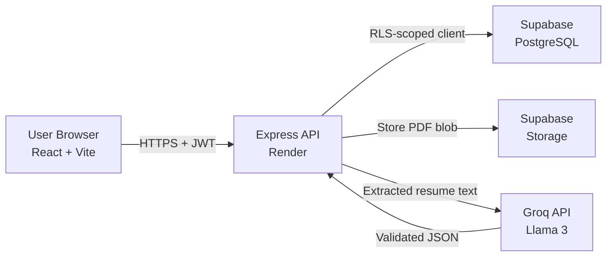
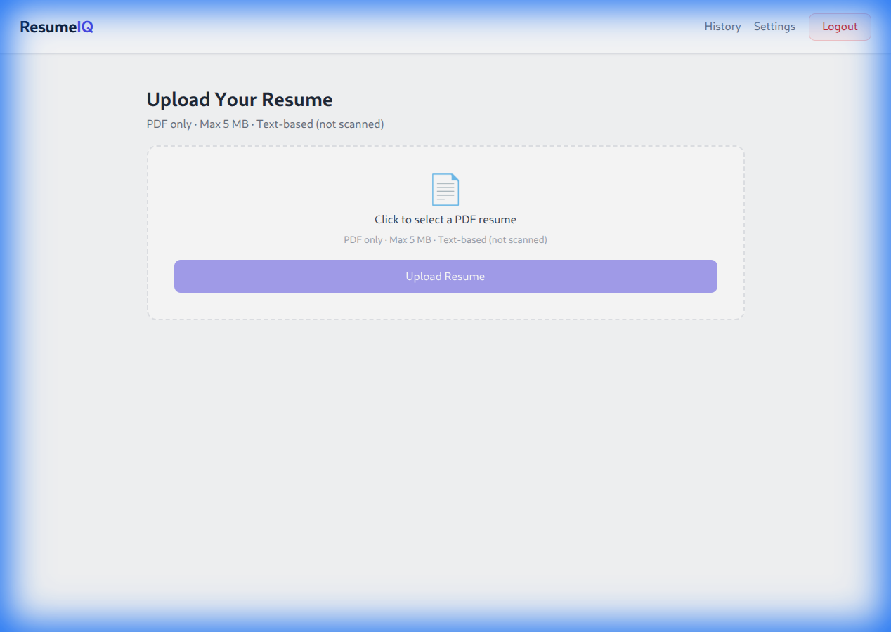
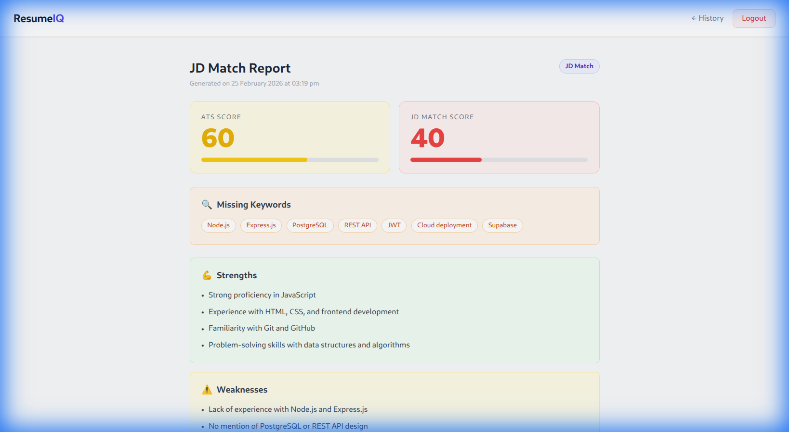
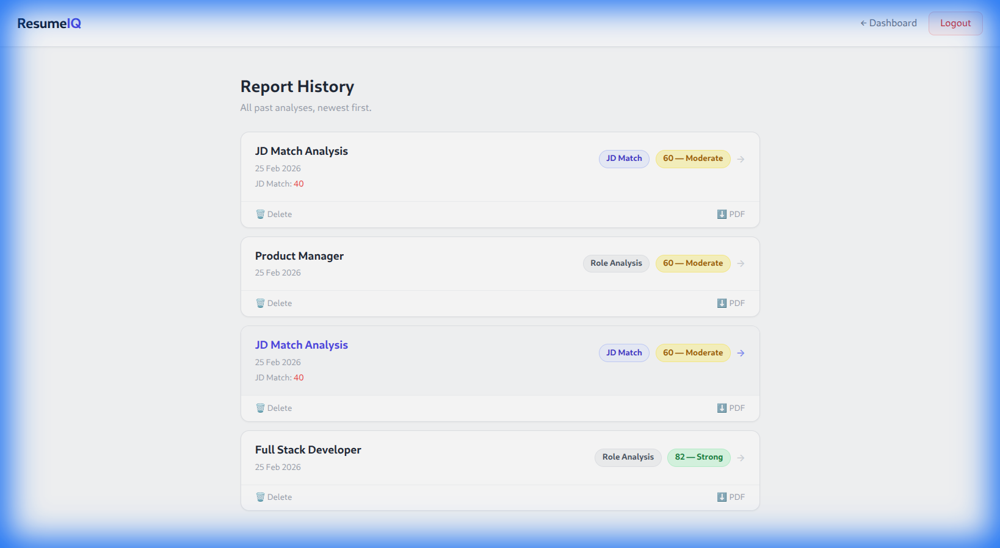

# ResumeIQ — Production-Grade AI ATS Resume Optimizer (Full-Stack SaaS)

A secure, multi-tenant SaaS application that analyzes resumes using AI, enforces row-level data isolation with Supabase RLS, and provides ATS-style optimization with role-based and job-description-based evaluation.

[](https://resume-iq-chi.vercel.app)
[](https://resumeiq-backend-lhh4.onrender.com/health)
[](./LICENSE)

---

## Live Demo

| Service | URL |
|---|---|
| Frontend | [resume-iq-chi.vercel.app](https://resume-iq-chi.vercel.app) |
| Backend API | [resumeiq-backend-lhh4.onrender.com](https://resumeiq-backend-lhh4.onrender.com/health) |

---

## Why This Project

Most resume tools provide static suggestions. ResumeIQ simulates an actual ATS pipeline by:

- Extracting raw resume text from uploaded PDF
- Applying AI-based semantic analysis via Groq (Llama 3)
- Comparing against structured job requirements in JD mode
- Returning strict JSON — **validated server-side before persistence**
- Persisting results securely per user using **Supabase Row Level Security**

This demonstrates backend security design, AI integration, and multi-tenant data isolation in a production-deployed application.

---

## Architecture Overview



---

## Screenshots

| Dashboard | Report | History |
|---|---|---|
|  |  |  |

---

## Features

- 📄 **PDF Resume Upload** — text-based, max 5 MB
- 🎯 **Role Analysis** — score against a target role (e.g., Full Stack Developer)
- 📋 **JD Match** — paste a job description, get a match score + missing keywords
- 📊 **ATS Score • Strengths • Weaknesses • Suggestions**
- 🔒 **Auth** — email verification, forgot / reset / change password
- 📁 **Report History** — view, download PDF, or delete past reports
- ⬇️ **PDF Export** — single-page formatted PDF download
- 🛡️ **Rate Limiting** — 10 AI reports per user per day

---

## Tech Stack

| Layer | Technology |
|---|---|
| **Frontend** | React (Vite), Tailwind CSS, Axios, React Router v7 |
| **Backend** | Node.js, Express 5 |
| **Database** | Supabase (PostgreSQL) with Row Level Security |
| **Storage** | Supabase Storage |
| **Auth** | Supabase Auth (JWT) |
| **AI** | Groq API (Llama 3) |
| **PDF Generation** | PDFKit |
| **Security** | Helmet, express-rate-limit, Zod validation |
| **Deployment** | Vercel (frontend) · Render (backend) |

---

## Key Engineering Decisions

- **Frontend and backend separated** — clear trust boundary; backend never trusts client state
- **Supabase RLS over manual filtering** — user isolation enforced at the database level, impossible to bypass via API
- **Request-scoped Supabase client** — each request creates a user-authenticated client from the JWT, preserving RLS context for every query
- **Strict CORS + Helmet** — only whitelisted origins can reach the API
- **AI response validation** — Groq output is schema-checked before any DB write; malformed AI JSON is rejected with 502, never persisted
- **Service role key never exposed to frontend** — only the anon key goes to the browser; service role used only for server-side admin operations

---

## System Architecture

```
User Browser (React)
    │
    │  HTTPS  +  Authorization: Bearer <JWT>
    ▼
Express API (Render)
    │
    ├── verifyUser middleware
    │       └── supabase.auth.getUser(JWT)
    │               → attaches user object + RLS-scoped client to req
    │
    ├── POST /api/resume/upload
    │       ├── Multer — parse multipart/form-data PDF
    │       ├── Supabase Storage — store at {userId}/{timestamp}.pdf
    │       └── Supabase DB    — INSERT into resumes (RLS: user_id = auth.uid())
    │
    └── POST /api/report/generate
            ├── COUNT reports today (RLS-scoped) → enforce 10/day limit
            ├── SELECT resume row          (RLS-scoped)
            ├── Supabase Storage           → download PDF blob
            ├── pdf-parse                  → extract plain text
            ├── Groq API                   → AI analysis (role or JD prompt)
            ├── Zod / shape validation     → reject invalid AI output
            └── INSERT into reports        (RLS-scoped)
```

---

## Folder Structure

```
resumeiq/
├── client/                    # React frontend (Vite)
│   ├── src/
│   │   ├── components/        # UploadBox, ProtectedRoute
│   │   ├── pages/             # Dashboard, History, ReportDetail, Settings, Login…
│   │   ├── services/          # api.js (axios instance), pdf.js (download helper)
│   │   └── main.jsx           # Router + auth guard setup
│   ├── vercel.json            # SPA rewrite rule
│   └── .env.example
│
├── server/                    # Express backend
│   ├── controllers/           # auth, resume, report
│   ├── middleware/            # auth (JWT verify), validate, error, rateLimit, async
│   ├── routes/                # auth.routes, resume.routes, report.routes
│   ├── schemas/               # Zod schemas (auth, report inputs)
│   ├── services/              # supabase.js, ai.service.js, pdf.service.js, report.pdf.service.js
│   ├── utils/                 # ApiError, response helpers, validateEnv
│   └── server.js
│
└── supabase/
    └── schema.sql             # Tables + RLS policies + storage bucket + storage policies
```

---

## Database Schema

### `resumes`
| Column | Type | Notes |
|---|---|---|
| `id` | UUID | Primary key |
| `user_id` | UUID | FK → `auth.users` (ON DELETE CASCADE) |
| `file_path` | TEXT | Storage path: `{userId}/{timestamp}-file.pdf` |
| `created_at` | TIMESTAMPTZ | Auto |

### `reports`
| Column | Type | Notes |
|---|---|---|
| `id` | UUID | Primary key |
| `user_id` | UUID | FK → `auth.users` |
| `resume_id` | UUID | FK → `resumes` |
| `analysis_type` | TEXT | `'role'` or `'jd'` |
| `role` | TEXT | Filled when type = role |
| `score` | INTEGER | 0–100 ATS score |
| `match_score` | INTEGER | 0–100, JD mode only |
| `strengths` | TEXT[] | Max 5 items |
| `weaknesses` | TEXT[] | Max 5 items |
| `suggestions` | TEXT[] | Max 5 items |
| `missing_keywords` | TEXT[] | JD mode only, max 10 |
| `job_description` | TEXT | JD mode only |
| `created_at` | TIMESTAMPTZ | Auto |

> Full schema with RLS policies and storage bucket setup: [`supabase/schema.sql`](./supabase/schema.sql)

---

## Security Architecture

### JWT Authentication Flow
```
1. User logs in → Supabase returns JWT access token
2. Client stores token in localStorage
3. Every API request: Authorization: Bearer <token>
4. verifyUser middleware calls supabase.auth.getUser(token):
   - Valid  → creates RLS-scoped supabase client (req.supabase)
   - Invalid → 401 Unauthorized
5. All DB queries use req.supabase — RLS enforces user isolation automatically
```

### Row Level Security (RLS)
RLS is enabled on all tables. Every policy uses `auth.uid() = user_id`:
- Users can only `SELECT`, `INSERT`, `DELETE` their own rows
- No cross-user data is ever returned, even with a valid JWT from another user
- Storage objects are protected by path prefix matching against `auth.uid()`

**The backend never trusts client input. All AI responses are schema-validated before persistence to prevent malformed JSON from being stored.**

### Additional Security Layers
| Protection | Implementation |
|---|---|
| CORS | Exact-origin whitelist only |
| Security headers | Helmet (CSP, HSTS, X-Frame-Options…) |
| Request validation | Zod schemas on every route |
| General rate limit | 100 req / 15 min per IP |
| Auth rate limit | 20 req / 15 min per IP |
| AI usage limit | 10 reports / day per user (DB-enforced) |
| Upload limit | 5 MB, PDF only |
| Password rules | Min 8 chars, upper, lower, number, special char |

---

## Cost Control Strategy

To prevent uncontrolled AI spend in production:

- Daily report generation capped at **10 per user**
- Limit enforced **server-side** via `COUNT` query scoped by RLS — cannot be bypassed by the client
- AI responses are **validated before persistence** — failed/malformed responses are rejected without DB writes
- File uploads capped at **5 MB** to prevent large payload abuse
- Groq's free tier (Llama 3) keeps AI cost near zero for small-scale usage

---

## Environment Variables

### `server/.env`
```env
SUPABASE_URL=https://your-project.supabase.co
SUPABASE_ANON_KEY=your_anon_key
SUPABASE_SERVICE_KEY=your_service_role_key

GROQ_API_KEY=gsk_your_groq_key

PORT=5000
ALLOWED_ORIGINS=http://localhost:5173
FRONTEND_URL=http://localhost:5173
```

### `client/.env`
```env
VITE_SUPABASE_URL=https://your-project.supabase.co
VITE_SUPABASE_ANON_KEY=your_anon_key
VITE_API_URL=http://localhost:5000/api
```

---

## Local Development Setup

### Prerequisites
- Node.js 18+
- A [Supabase](https://supabase.com) project
- A [Groq](https://console.groq.com) API key (free)

### 1. Clone & install
```bash
git clone https://github.com/vishalkumar321/resumeIQ.git
cd resumeiq

cd server && npm install
cd ../client && npm install
```

### 2. Configure environment
```bash
cp server/.env.example server/.env
cp client/.env.example client/.env
# Fill in values
```

### 3. Set up Supabase
Run [`supabase/schema.sql`](./supabase/schema.sql) in your Supabase **SQL Editor**.
This creates tables, RLS policies, storage bucket, and storage policies.

### 4. Start development
```bash
# Terminal 1 — Backend (port 5000)
cd server && npm run dev

# Terminal 2 — Frontend (port 5173)
cd client && npm run dev
```

---

## Production Deployment

### Backend → Render
| Setting | Value |
|---|---|
| Root Directory | `server` |
| Build Command | `npm install` |
| Start Command | `node server.js` |
| Environment | All 6 vars from `server/.env` |

### Frontend → Vercel
| Setting | Value |
|---|---|
| Root Directory | `client` |
| Framework | Vite (auto-detected) |
| Environment | All 3 vars from `client/.env` |

> `client/vercel.json` handles SPA routing automatically — no manual config needed.

After deploying the frontend, update `ALLOWED_ORIGINS` and `FRONTEND_URL` in Render to your Vercel URL and redeploy.

---

## How Email Verification Works

```
1. User signs up → POST /api/auth/signup
2. Server calls supabase.auth.signUp() with emailRedirectTo: FRONTEND_URL/login
3. Supabase sends verification email
4. User clicks link → redirected to /login?verified=true
5. Login page shows "Email verified" confirmation banner
6. Login checks email_confirmed_at — unverified accounts are blocked with 403
```

---

## How JD Match Works

The AI receives extracted resume text + the pasted job description. The system prompt instructs Llama 3 (via Groq) to act as an ATS scanner and return **strict JSON only**:

```json
{
  "score": 60,
  "match_score": 40,
  "strengths": ["..."],
  "weaknesses": ["..."],
  "suggestions": ["..."],
  "missing_keywords": ["Node.js", "Docker", "..."]
}
```

| Field | Meaning |
|---|---|
| `score` | How well the resume is formatted/optimized generally (0–100) |
| `match_score` | How specifically it targets the given JD (0–100) |
| `missing_keywords` | Terms present in JD but absent in resume |

The controller validates the response shape before any DB insert. Invalid AI output → 502 error, nothing persisted.

---

## API Endpoints

### Auth — `/api/auth`
| Method | Endpoint | Auth | Description |
|---|---|---|---|
| POST | `/signup` | No | Register + send verification email |
| POST | `/login` | No | Login, returns JWT |
| POST | `/forgot-password` | No | Send password reset email |
| POST | `/change-password` | Yes | Update authenticated user's password |

### Resume — `/api/resume`
| Method | Endpoint | Auth | Description |
|---|---|---|---|
| POST | `/upload` | Yes | Upload PDF, store in Supabase Storage |

### Report — `/api/report`
| Method | Endpoint | Auth | Description |
|---|---|---|---|
| POST | `/generate` | Yes | Run AI analysis, save report |
| GET | `/history` | Yes | List all reports for authenticated user |
| GET | `/:id` | Yes | Fetch single report |
| GET | `/:id/pdf` | Yes | Stream report as formatted PDF |
| DELETE | `/:id` | Yes | Delete report |

---

## Topics This Project Demonstrates

- Multi-tenant SaaS architecture
- Row-Level Security (RLS) for data isolation
- JWT-based authentication with request-scoped DB clients
- Secure file handling (upload → storage → text extraction)
- AI integration with structured output validation
- Rate limiting and abuse prevention
- Production deployment (Vercel + Render)
- API design with consistent error handling

---

## Future Improvements

- [ ] LinkedIn profile import
- [ ] Resume auto-rewrite mode (AI rewrites bullet points)
- [ ] Multiple resume management per user
- [ ] Stripe subscription for higher daily limits
- [ ] OAuth login (Google, GitHub)
- [ ] Team / recruiter view to compare candidate scores
- [ ] Resume version history and diff view

---

## License

MIT © [Vishal Kumar](https://github.com/vishalkumar321)
